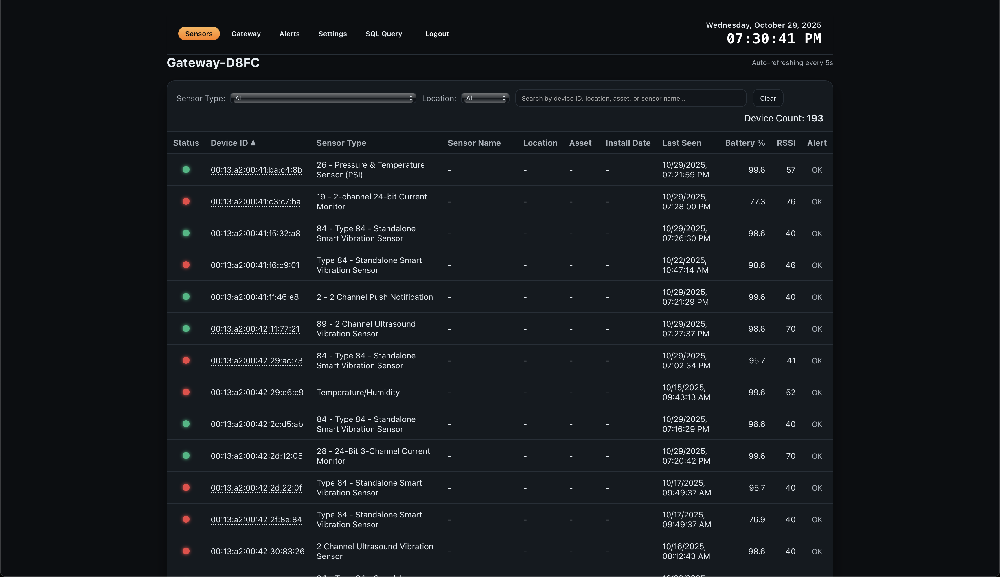
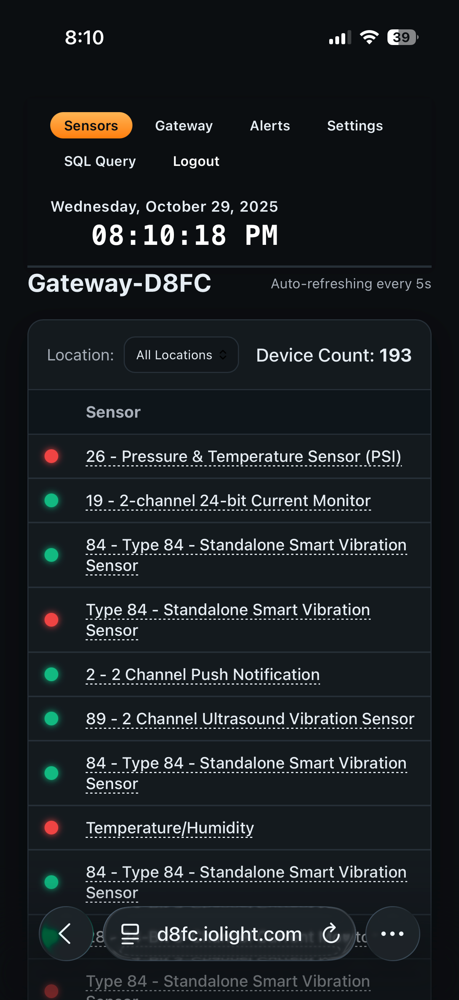

# Quick Start Guide - Atrium Gateway

**Get up and running in 5 minutes!**

---

## 🚀 Prerequisites

- Gateway device powered on and accessible
- Network connection to the gateway
- Web browser (Chrome, Firefox, Safari, Edge)

---

## 📋 Step 1: Access the Platform

### Local Access
Open your web browser and navigate to:
```
http://ncd-XXXX.local/ Where XXXX is the last 4 digits of your gateway's MAC Address.
```


*Figure 1: Atrium Gateway login screen*

### Remote Access (if enabled)
If remote access is configured:
```
https://XXXX.iolight.com/ Where XXXX is the last 4 digits of your Atrium Gateway MAC address.
```

---

## 🔐 Step 2: Login

**Default Credentials:**
- **Username:** `ncdio`
- **Password:** `ncdB3ast`

> ⚠️ **Security:** Change these credentials immediately after first login!


*Figure 2: Main dashboard after successful login*

---

## 📊 Step 3: View Your Sensors

The main page shows all your sensors with real-time status.


*Figure 3: Sensors list with status indicators and navigation*

**What you'll see:**
- **Sensor List** - All detected sensors
- **Status Indicators** - Online/Offline status
- **Real-time Updates** - Data refreshes every 5 seconds
- **Navigation** - Access to all features

---

## ⚙️ Step 4: Configure a Sensor

Click the **⚙️** (settings) button next to any sensor to configure it.


*Figure 4: Sensor configuration dialog*

**Basic Configuration:**
- **Sensor Name** - Give it a friendly name
- **Location** - Where is it installed?
- **Asset** - What is it monitoring?

---

## 📈 Step 5: View Sensor Dashboard

Click on any sensor to see its detailed dashboard with charts and metrics.


*Figure 5: Sensor dashboard with metrics and charts*

**Dashboard Features:**
- **Metric Cards** - Current values with color coding
- **Time Series Charts** - Historical data visualization
- **Time Range Selector** - View different time periods
- **Interactive Charts** - Zoom, pan, and hover for details

---

## 🚨 Step 6: Set Up Alerts (Optional)

Navigate to **Alerts** to configure email notifications.


*Figure 6: Alert configuration page*

**Basic Alert Setup:**
1. Click **"Add Alert"**
2. Select a sensor and metric
3. Set threshold value
4. Add email address
5. Save alert

---

## 📱 Step 7: Test Mobile Access

The platform works great on mobile devices!


*Figure 7: Mobile view with responsive navigation*

**Mobile Features:**
- **Responsive Design** - Adapts to screen size
- **Touch-Friendly** - Easy to use on touchscreens
- **Full Functionality** - All features available on mobile

---

## ✅ You're Ready!

Congratulations! You now have a fully functional sensor monitoring system.

### What's Next?

1. **Configure More Sensors** - Add names, locations, and assets
2. **Set Up Alerts** - Configure email notifications
3. **Explore Dashboards** - View historical data and trends
4. **Read the Full Guide** - [Complete User Guide](USER_GUIDE.md)

### Quick Tips

- **Auto-refresh** - Data updates automatically
- **Color coding** - Green = healthy, Red = problems
- **Click to explore** - Click metric cards to jump to charts
- **Mobile friendly** - Works on phones and tablets

---

## 🆘 Need Help?

- **Full Documentation** - [User Guide](USER_GUIDE.md)
- **Troubleshooting** - See the troubleshooting section
- **Support** - Contact your system administrator

---

**Platform Version:** 1.0.6  
**Last Updated:** October 2025  
**Platform:** Atrium Gateway
