# Gateway IoT Platform - User Guide

**Version 1.0.6** | **Last Updated: October 2025**

---

## Table of Contents

1. [Getting Started](#getting-started)
2. [System Overview](#system-overview)
3. [Navigation](#navigation)
4. [Sensor Management](#sensor-management)
5. [Sensor Dashboards](#sensor-dashboards)
6. [Alert System](#alert-system)
7. [Gateway Management](#gateway-management)
8. [Data Export & Analysis](#data-export--analysis)
9. [Mobile Access](#mobile-access)
10. [Troubleshooting](#troubleshooting)
11. [Advanced Features](#advanced-features)

---

## Getting Started

### First Login

When you first access the Gateway IoT Platform, you'll see the login screen.

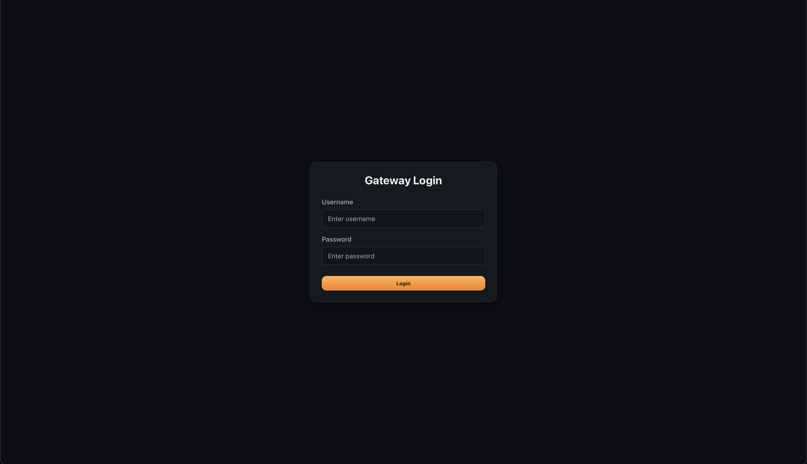
*Figure 1: Gateway IoT Platform login screen with dark theme styling*

**Default Credentials:**
- **Username:** `ncdio`
- **Password:** `ncdB3ast`

> ⚠️ **Important:** Change these credentials immediately after first login for security.

### Accessing the Platform

The platform can be accessed in two ways:

1. **Local Network:** `http://[gateway-ip]/`
2. **Remote Access:** `https://[your-subdomain].iolight.com/` (if Cloudflare tunnel is enabled)

*Figure 2: Main sensors list page with global navigation header and sample sensors*

---

## System Overview

The Gateway IoT Platform is a comprehensive sensor monitoring system that provides:

- **Real-time sensor monitoring** with live data updates
- **Interactive dashboards** with time-series charts
- **Alert management** with email notifications
- **Device management** with whitelist/blacklist controls
- **Data export** capabilities
- **Mobile-responsive** interface
- **Remote access** via secure tunnels

### Key Features

- **Live Data:** Sensors update every 5 seconds automatically
- **Historical Data:** View data from 1 hour to 30 days
- **Smart Alerts:** Hysteresis-based alerting prevents spam
- **Bulk Operations:** Manage multiple sensors at once
- **Data Export:** CSV export for analysis
- **Mobile Support:** Works on phones and tablets

---

## Navigation

### Global Navigation Header

The platform uses a unified navigation system across all pages.

*Figure 3: Global navigation bar with pill-styled buttons and date/time display*

**Navigation Options:**
- **Sensors** - Main sensor list and management
- **Gateway** - System health and configuration
- **Alerts** - Alert management and history
- **Settings** - Gateway configuration
- **SQL Query** - Advanced database queries

### Mobile Navigation

On mobile devices (screens ≤768px), the navigation automatically switches to a two-row layout:

*Figure 4: Two-row mobile navigation layout optimized for small screens*

**Row 1:** Sensors, Gateway, Alerts, Settings
**Row 2:** SQL Query, Logout

---

## Sensor Management

### Sensors List Page

The main page shows all your sensors with real-time status information.

*Figure 5: Sensors list with all columns, sorting indicators, and search functionality*

#### Sensor Information Columns

- **Status** - Online/Offline indicator with color coding
- **Device ID** - Unique sensor identifier
- **Sensor Type** - Type of sensor (Temperature, Humidity, etc.)
- **Sensor Name** - Custom name you've assigned
- **Location** - Physical location of the sensor
- **Asset** - Asset the sensor is monitoring
- **Last Heard** - Time since last data transmission
- **Alert** - Active alert indicator (red "Alert" badge or gray "OK")

#### Sorting and Filtering

- **Click column headers** to sort by that field
- **Search box** to filter sensors by any field
- **Real-time updates** every 5 seconds

### Adding Sensor Information

Click the **⚙️** (settings) button next to any sensor to configure it.

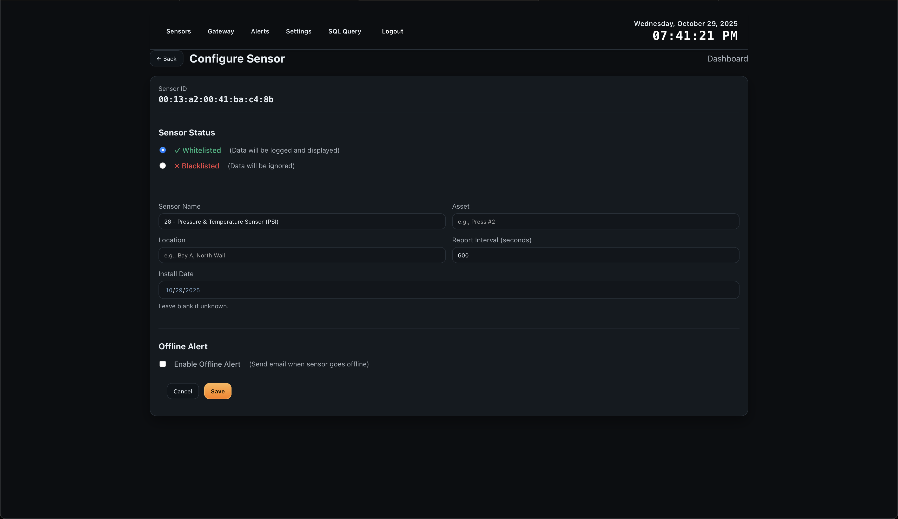
*Figure 6: Sensor configuration modal with all settings fields*

#### Configuration Options

- **Sensor Name** - Custom name for easy identification
- **Location** - Physical location (e.g., "Building A - Floor 2")
- **Asset** - What the sensor is monitoring (e.g., "Server Room AC")
- **Install Date** - When the sensor was installed
- **Report Interval** - How often sensor should transmit (seconds)
- **Offline Alert** - Enable/disable alerts when sensor goes offline
- **Alert Emails** - Email addresses for offline alerts

### Device Management

#### Whitelist/Blacklist Control

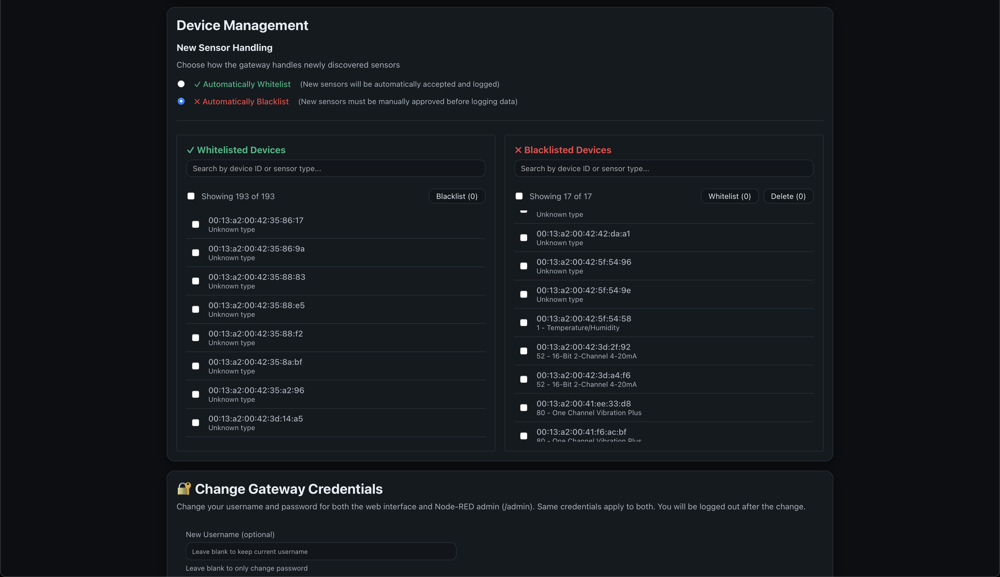
*Figure 7: Device Management section with whitelist/blacklist controls*

**New Sensor Handling:**
- **Automatically Whitelist** - New sensors are automatically approved
- **Automatically Blacklist** - New sensors are automatically blocked

**Bulk Operations:**
- **Select All** checkbox for whitelisted devices
- **Move to Blacklist** - Move selected devices to blacklist
- **Move to Whitelist** - Move selected devices to whitelist
- **Delete** - Remove devices from the system

---

## Sensor Dashboards

### Individual Sensor Dashboards

Click on any sensor to view its detailed dashboard with charts and metrics.

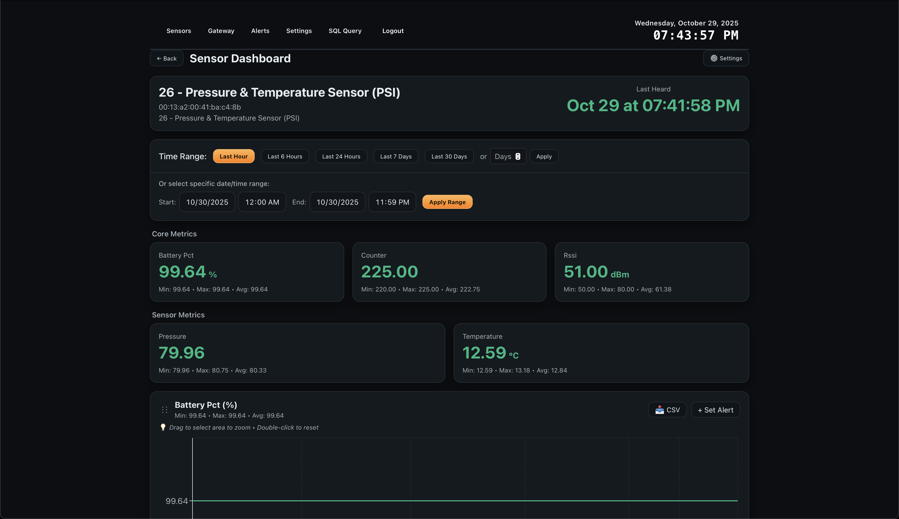
*Figure 8: Individual sensor dashboard with metric cards and time-series charts*

#### Metric Cards

**Core Metrics:**
- **Battery %** - Current battery level (green if >30%, red if <30%)
- **RSSI** - Signal strength (green if good, red if poor >75dBm)
- **Counter** - Transmission sequence number (0-255)

**Sensor Metrics:**
- **Temperature** - Current temperature reading
- **Humidity** - Current humidity reading
- **Other metrics** - Depends on sensor type

*Figure 9: Color-coded metric cards showing health status indicators*

#### Interactive Charts

- **Click metric cards** to scroll to corresponding chart
- **Drag to zoom** on charts
- **Double-click** to reset zoom
- **Hover** for detailed values
- **Drag to pan** when zoomed

*Figure 10: Interactive chart with zoom selection and tooltip display*

#### Time Range Selection

**Available Ranges:**
- **1 Hour** - Last hour of data
- **6 Hours** - Last 6 hours
- **24 Hours** - Last 24 hours
- **7 Days** - Last 7 days
- **30 Days** - Last 30 days
- **Custom** - Select specific date/time range

*Figure 11: Time range dropdown and custom date/time picker*

#### Chart Features

- **Auto-refresh** every 30 seconds
- **Min/Max/Average** statistics for each chart
- **CSV Export** button (📥) on each chart
- **Chart reordering** via drag-and-drop
- **Responsive design** for mobile

### Gateway Dashboard

Access system-wide metrics and health information.

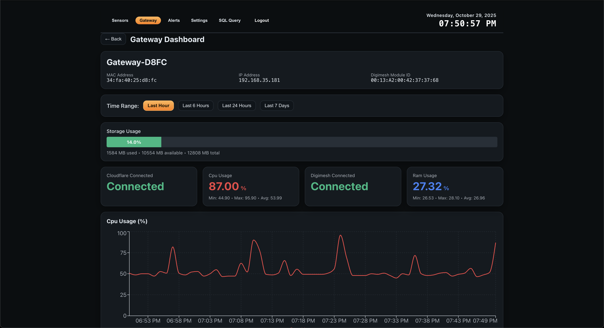
*Figure 12: Gateway dashboard with system health metrics and charts*

#### System Metrics

- **Storage Usage** - Color-coded storage bar
- **CPU Usage** - Current CPU utilization
- **Memory Usage** - RAM usage statistics
- **Network Status** - Connectivity indicators
- **Temperature** - System temperature

---

## Alert System

### Alert Management

The Alerts page shows all configured alerts and their current status.

*Figure 13: Alerts management page with configured alerts and status indicators*

#### Alert Configuration

*Figure 14: Alert configuration modal with threshold and email settings*

**Alert Settings:**
- **Metric** - Which sensor reading to monitor
- **Threshold Value** - Alert trigger point
- **Condition** - Above or below threshold
- **Reset Value** - Point where alert clears
- **Enabled** - Turn alert on/off
- **Email Recipients** - Who gets notified
- **Multiple Recipients** - Add multiple email addresses

#### Alert History

*Figure 15: Alert history page with past events and search functionality*

**History Features:**
- **Search/Filter** by device ID, sensor name, or metric
- **Color-coded badges** (red for triggered, green for cleared)
- **Clickable device IDs** to navigate to dashboards
- **Auto-refresh** every 10 seconds

### Email Notifications

*Figure 16: Sample email alert notification with alert details*

**Email Content:**
- Alert type and severity
- Sensor information
- Current reading vs. threshold
- Timestamp in local timezone
- Gateway information

---

## Gateway Management

### Gateway Configuration

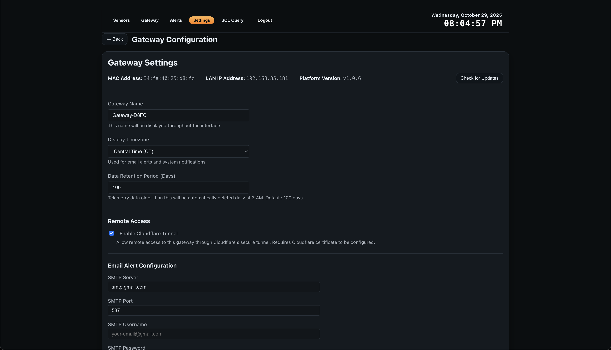
*Figure 17: Gateway configuration page with all settings sections*

#### Gateway Settings

- **Gateway Name** - Custom name for the gateway
- **Remote Access** - Enable/disable Cloudflare tunnel
- **Email Configuration** - SMTP settings for alerts
- **Timezone** - Display timezone for emails
- **Data Retention** - How long to keep data (days)

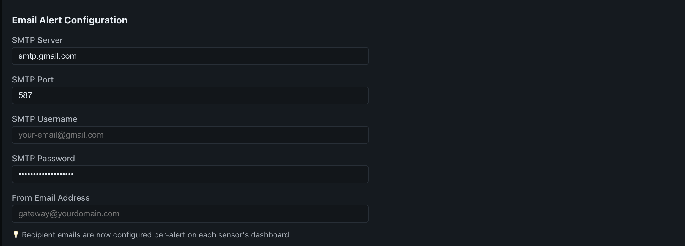
*Figure 18: SMTP email configuration section*

#### Device Management

- **New Sensor Handling** - Auto-whitelist or blacklist new sensors
- **Whitelisted Devices** - Currently approved sensors
- **Blacklisted Devices** - Blocked sensors
- **Bulk Operations** - Manage multiple devices

#### Security Settings

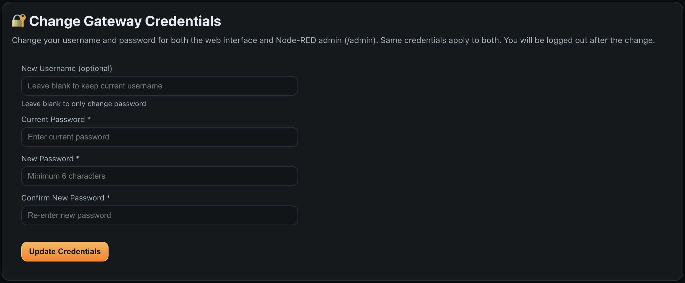
*Figure 19: Change password dialog with security fields*

- **Change Password** - Update login credentials
- **Current Password** - Verify current password
- **New Password** - Enter new password
- **Confirm Password** - Re-enter new password

#### System Updates

*Figure 20: System update notification and update dialog*

- **Check for Updates** - Manual update check
- **Update Available** - Notification when updates are ready
- **One-Click Update** - Automatic update process
- **Rollback** - Automatic rollback on failure

### System Health

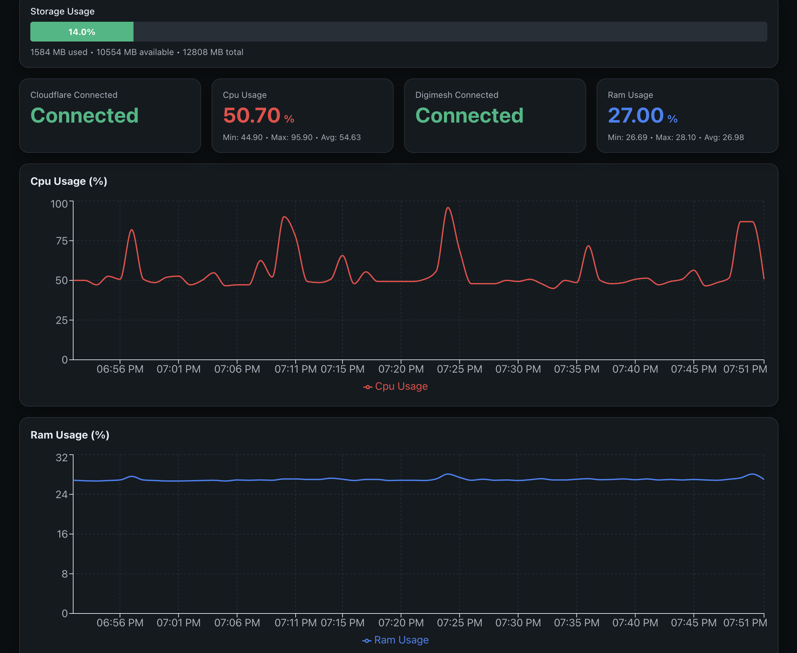
*Figure 21: System health metrics and monitoring dashboard*

#### Health Indicators

- **Storage** - Color-coded usage bar (green/yellow/red)
- **CPU** - Current utilization percentage
- **Memory** - RAM usage and available
- **Temperature** - System temperature
- **Network** - Connectivity status
- **Uptime** - System uptime

---

## Data Export & Analysis

### CSV Export

Export sensor data for external analysis.

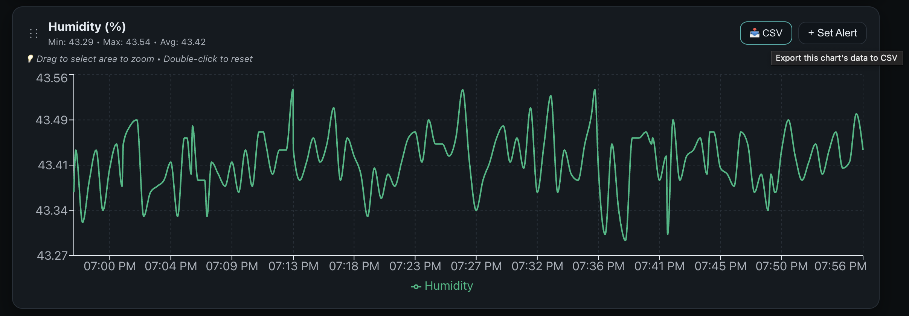
*Figure 22: CSV export options and export dialog*

**Export Options:**
- **Per-Chart Export** - Export individual metric data
- **Full Dashboard Export** - Export all metrics
- **Custom Date Range** - Select specific time period
- **Include Timestamps** - Add readable date/time columns

### SQL Query Tool

Advanced users can run custom database queries.

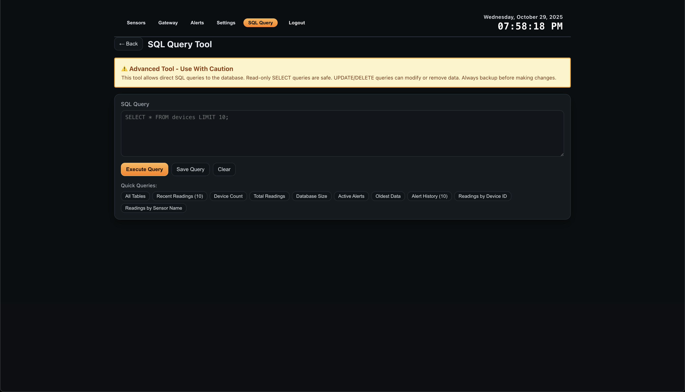
*Figure 23: SQL query tool with input area and results table*

**Features:**
- **Custom Queries** - Write your own SQL
- **Quick Queries** - Pre-built common queries
- **Save Queries** - Store frequently used queries
- **Export Results** - Download query results as CSV
- **Safety Warnings** - Prevent destructive operations

#### Quick Query Examples

- **Recent Readings** - Latest sensor data
- **Alert History** - Past alert events
- **Device Status** - All device information
- **Storage Usage** - Database size and growth
- **Performance Metrics** - System statistics

---

## Mobile Access

### Mobile Interface

The platform is fully responsive and optimized for mobile devices.

*Figure 24: Mobile view of sensors list with touch-friendly interface*

**Mobile Features:**
- **Touch-Friendly** - Large tap targets
- **Responsive Navigation** - Two-row layout
- **Swipe Gestures** - Natural mobile interactions
- **Optimized Charts** - Touch-optimized chart controls
- **Fast Loading** - Optimized for mobile networks

### Mobile Navigation

*Figure 25: Detailed mobile navigation layout*

**Navigation Layout:**
- **Row 1:** Sensors, Gateway, Alerts, Settings
- **Row 2:** SQL Query, Logout
- **Auto-Detection** - Switches based on screen size
- **No Horizontal Scrolling** - Fits all screen sizes

---

## Troubleshooting

### Common Issues

#### Login Problems

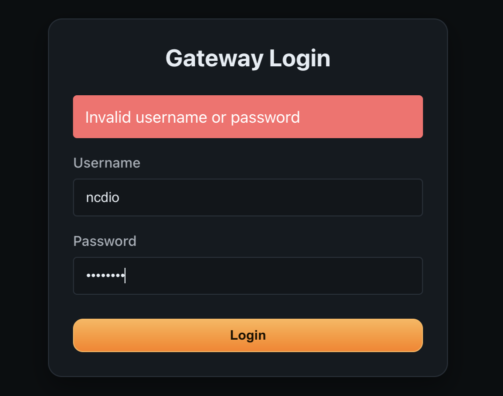
*Figure 26: Login error messages and troubleshooting information*

**Solutions:**
- Verify username and password
- Check network connectivity
- Clear browser cache
- Try different browser

#### Sensor Not Appearing

*Figure 27: Device management panel for troubleshooting missing sensors*

**Solutions:**
- Check if sensor is whitelisted
- Verify sensor is powered on
- Check report interval settings
- Look for offline alerts

#### Data Not Updating

*Figure 28: Refresh indicators and auto-update settings*

**Solutions:**
- Check auto-refresh is enabled
- Verify sensor is transmitting
- Check network connectivity
- Restart browser

#### Alert Not Sending

*Figure 29: Alert settings and email configuration for troubleshooting*

**Solutions:**
- Verify SMTP settings
- Check email addresses
- Test email configuration
- Check alert thresholds

### Getting Help

*Figure 30: Support resources and help information*

**Support Resources:**
- **Documentation** - This user guide
- **System Logs** - Check for error messages
- **Contact Support** - Technical support information
- **Community** - User forums and discussions

---

## Advanced Features

### Remote Access

**Screenshot Placeholder: Remote Access Settings**
*Show the Cloudflare tunnel configuration and remote access settings.*

**Remote Access Features:**
- **Secure HTTPS** - Encrypted connections
- **Cloudflare Tunnel** - No port forwarding needed
- **Dynamic DNS** - Automatic subdomain assignment
- **Access Control** - Enable/disable remotely

### Data Management

**Screenshot Placeholder: Data Retention Settings**
*Show the data retention configuration and cleanup settings.*

**Data Management:**
- **Automatic Cleanup** - Remove old data
- **Retention Periods** - Configurable data lifetime
- **Storage Monitoring** - Track database size
- **Backup Options** - Data export and backup

### System Administration

**Screenshot Placeholder: Admin Panel**
*Show administrative functions and system management options.*

**Admin Features:**
- **User Management** - Account administration
- **System Updates** - Software updates
- **Configuration Backup** - Settings export/import
- **Log Management** - System log access

---

## Quick Reference

### Keyboard Shortcuts

- **Ctrl+R** - Refresh current page
- **Ctrl+F** - Search/filter
- **Escape** - Close dialogs
- **Enter** - Submit forms

### Status Indicators

- **🟢 Green** - Healthy/Online
- **🔴 Red** - Alert/Offline/Problem
- **🟡 Yellow** - Warning/Caution
- **⚪ Gray** - Inactive/Disabled

### Time Formats

- **Last Heard** - Relative time (e.g., "2 minutes ago")
- **Charts** - Absolute timestamps
- **Alerts** - Local timezone
- **Exports** - ISO format with timezone

---

## Support and Updates

### Getting Updates

The system automatically checks for updates every 12 hours. You can also check manually:

1. Go to **Settings** → **Gateway Configuration**
2. Click **"Check for Updates"**
3. Click **"Update Now"** if available

### Version Information

**Current Version:** 1.0.6
**Last Updated:** October 2025
**Platform:** Gateway IoT Platform

### Contact Information

For technical support or questions:
- **Email:** [support-email]
- **Documentation:** [documentation-url]
- **Community:** [community-forum]

---

*This user guide covers the Gateway IoT Platform v1.0.6. For the most up-to-date information, please refer to the online documentation.*
